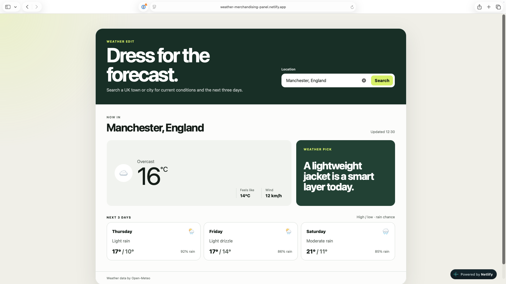
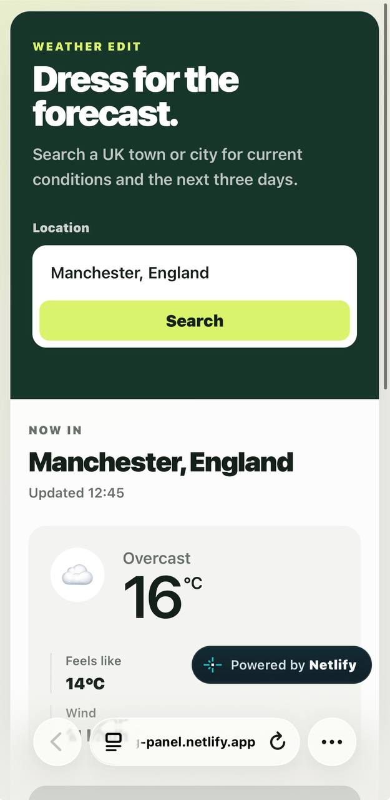

# Weather Merchandising Panel

A responsive weather panel for an outerwear retailer, built as a standalone front-end exercise using the free Open-Meteo API. No backend, paid service or API key is required.

I kept the build deliberately lightweight for the brief's under-two-hour timebox. The single optional stretch I chose was packaging the component as a Shopify theme section.

## Run locally

No dependencies or build step are required.

```bash id="x9c3m2"
python3 -m http.server 8080
```

Then open `http://localhost:8080`. VS Code Live Server works too.

## Live demo
View the live demo on Netlify `http://weather-merchandising-panel.netlify.app`

## Preview

## Preview

### Desktop




### Mobile



## Included

* UK town/city search with selectable Open-Meteo geocoding results.
* Current temperature, feels-like temperature, readable condition and wind speed.
* Three-day outlook showing the next three days, excluding today, from the requested four-day forecast.
* Weather-driven merchandising messages for rain, cold/snow, wind, warm and default conditions.
* Loading, no-results, timeout, incomplete-response and API/network failure handling.
* Stale requests are cancelled when a newer search or forecast starts.
* Responsive mobile/desktop layout.
* Shopify stretch: `sections/weather-panel.liquid`, with Theme Editor settings for the default UK location and merchandising messages.

## Shopify version

The standalone page remains the main submission, as requested. The Liquid file shows how the same panel can be added as an Online Store 2.0 section. Its `` exposes the default location plus rain, cold/snow, wind, warm and fallback merchandising messages.

## With more time

* Add automated tests and keyboard navigation for search results.
* Replace emoji weather icons with a consistent SVG set.
* Add configurable CTA links to the merchandising messages.

## Client considerations

* Promotional messaging should remain editable in Shopify.
* The implementation depends on Open-Meteo, so API failures and slow responses are handled gracefully.
* The current version is UK-specific and uses `Europe/London`.

## AI usage

I used Claude Code selectively for edge-case review and implementation checks.
It suggested an approach to request-cancellation handling, which I revised before testing the final solution.